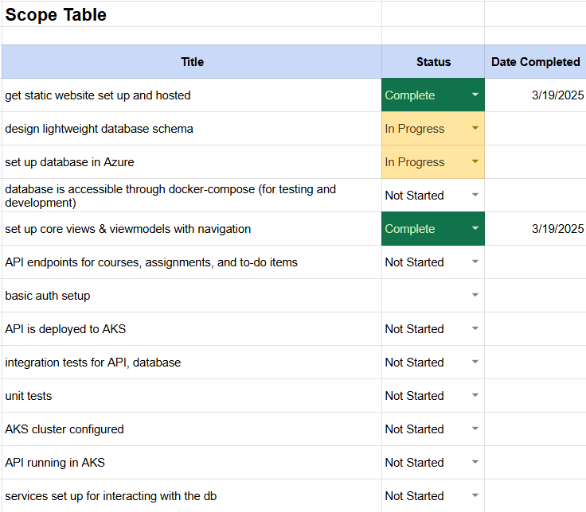
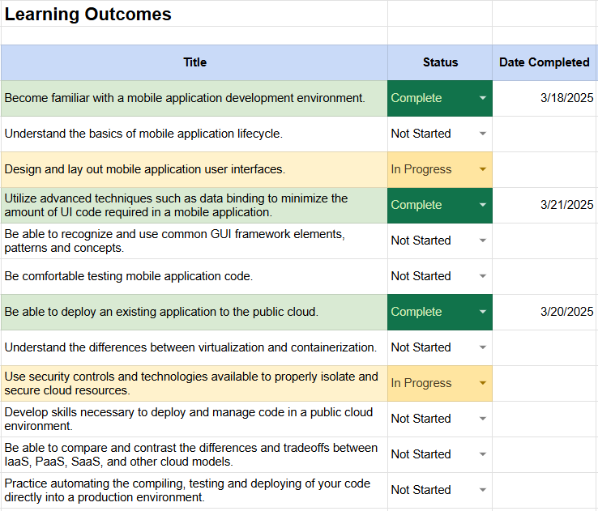
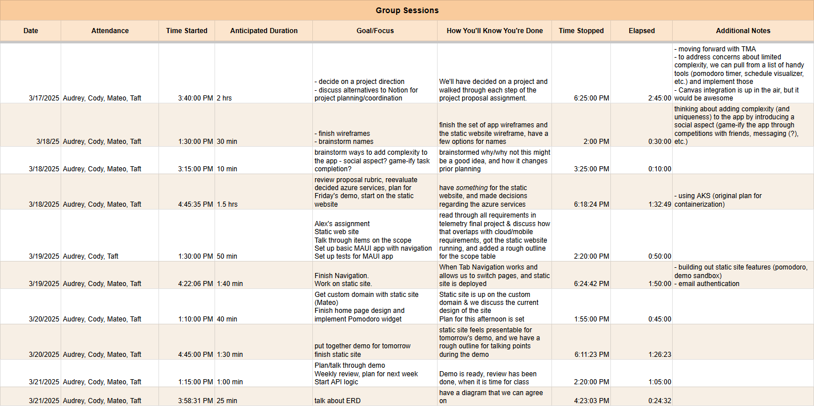
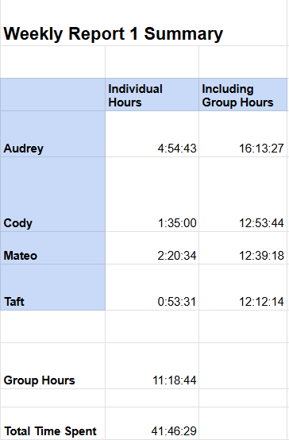

 03/22/2025 

# Weekly Report 1

## Progress Summary

 

---

## Work Logs
These time logs outline our meetings spent mob programming, debugging, and planning as a group.

 

 
Here is a [link](https://docs.google.com/spreadsheets/d/18VnP5M3QZ9fHyKty3yBczf-pbReVf3Z-3jlyZqaL7vE/edit?usp=sharing) to the spreadsheet we're using to track our time.

---
## Blocking Issues
Share 3+ different blocking issues that you were stuck on for a while, and how you resolved them.

#### 1. Static Site Deployment - npm
* **Description:** 
  - npm is breaking only within our folder.
* **Attempts To Fix:**
  - Tried pulling the docker image found in the workflow, then exec-ed into the container and looked at the relevant script. It didn't tell us anything helpful
  - Escalated to Alex, then solved the problem on our own. 
* **Solution:**
  - We read the error messages in the deployment logs more clearly, and realized that the output location was incorrect. Adjusted this to work with vite, and fixed the problem.

#### 2. Static Site Not Building
* **Description/Solution:** 
    - npm is broken in our project folder, but we can work around this by using vite commands directly:
      - `Vite`
      - `Vite Build`

#### 3. Toggling Between Tools
* **Description:** 
  - To toggle between tool controls in the UI, we initially wanted  to use multiple ViewModels for a single ContentView, but weren't sure this was possible (or a good idea).
* **Attempts To Fix/Solution:**
  - As we explored other options, we found a much better solution. Now, we're binding the IsVisible property for each tool to a bool that indicates whether it is active.