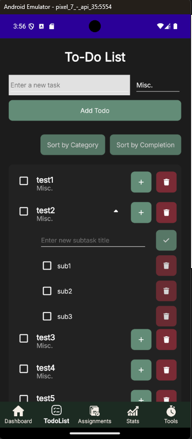

## Version Displayed

## Positive Feedback
- good color scheme

## Negative Feedback
- overall design is boring
- could save visual space on To-Dos section: indent the subtasks less, decrease the space in between buttons

## Feature Suggestions
- add some kind of security for deleting tasks, like a popup alert asking if you're sure about deleting it
- allow the user to filter by categories, so they can focus on one category at a time without feeling overwhelmed
    - without the ability to feature, she said that she would be inclined to use the app "incorrectly," treating tasks as categories and subtasks as the major tasks

## Adjusted Version
[To be continued]